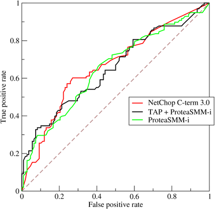
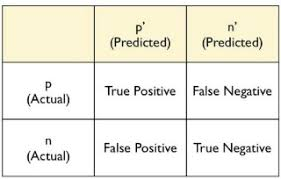

# 용어 정리

## A

### A/B Testing     

A 방법론과 B 방법론을 비교하여 **통계적인 유의미성**을 가지는지의 여부를 파악하는 것. 측정항목의 갯수의 제한이 없음

### Accuracy
    
Multi-class classification :**accurate guesses / total classification**

Binary classification : **(True negative + True postitive) / Total classification**

### Activation function
이전 레이어의 **모든 입력에 대한 가중치의 합**을 가지고 출력값을 생성하여 다음 레이어로 전달하는 함수 **Ex: ReLU, 시그모이드**

### AdaGrad
각 매개변수의 경사를 재조정하여 각각의 매개변수마다 독립적인 학습률을 부여.

### AUC (Area Under the Curve)
ROC 곡선의 아래 영역이다. 이것으로 무작위로 선택한 긍정 예가 실제로 긍정일 가능성이 무작위로 선택한 부정 예가 긍정일 가능성보다 높다고 분류자가 신뢰할 확률입니다. 

The ROC curve is created by plotting the true positive rate (TP) against the false positive rate (FP) at various threshold settings
**TP가 높아지면 좋고 FP가 낮아지면 좋다.**
[자세한 설명](https://dsdoris.medium.com/roc-curve%EC%99%80-auc-%EC%9D%B4%ED%95%B4%ED%95%98%EA%B8%B0-126978d80a9e)



## B
### 역전파(Backpropagation) 

내가 뽑고자 하는 target값과 실제 모델이 계산한 output이 얼마나 차이가 나는지 구한 후 그 오차값을 다시 뒤로 전파해가면서 각 노드가 가지고 있는 변수들을 갱신하는 알고리즘이다 

[자세한 설명](https://evan-moon.github.io/2018/07/19/deep-learning-backpropagation/)

### baseline
참조지점으로 사용되는 모델(휴리스틱)

### Batch
모델 학습의 반복 1회, 즉 경사 업데이트 1회에 사용되는 예의 집합입니다.
```
Batch Gradient Descent. Batch Size = Size of Training Set
Stochastic Gradient Descent. Batch Size = 1
Mini-Batch Gradient Descent. 1 < Batch Size < Size of Training Set
```

### Bias
원점을 기준으로  한 절편 또는 오프셋입니다.
y = b + w1x1 + w2x2 + ... + wnxn 에서 b 가 bias

### Bin
Bucketing 에서의 한 cell. 컴비에서 썼던 bin과 동일

## C

### Calibration Layer (추가 공부 필요)

### Candidate Sampling
학습 도중 소프트맥스등을 사용하여 모든 긍정 라벨에 대한 확률을 계산하는 최적화이다. 부정 라벨의 경우 무작위 샘플에 대해서만 계산한다. 

### 범주형 데이터(Categorical data)
불연속 특성, 수치 데이터(numerical data)와 대비

EX: car color, car maker 등등... 

### Centroid
k-means 의 중심값들. (k-mean 참조)

### Class-imbalanced data set
두 클래스의 라벨이 서로 크게 다른 빈도를 보이는 이진 분류 문제입니다. 
ex)  A 의 확률 : 99%, B 의 확률이고 A와 B가 배타적인 성질을 가진 class라면 클래스 불균형 데이터 세트이다. 

### Classification model(분류모델)
불연속 클래스를 구분 짓는 데 사용되는 머신러닝 모델 유형이다.
ex) 자연어 처리에서 프랑스어인지 이탈리어인지 구별해주는 모델

### Classification threshold(분류임계값)
포지티브 클래스와 네거티브 클래스를 구분 짓기 위한 모델의 예측 점수에 적용되는 스칼라값 기준.
ex) ROC에서 적용되는 각각의 threshold 값

### Clustering
data를 grouping 하는 방법이라고 생각하면 편할 듯?

### Collaborative filtering
youtube 추천 동영상 시스템에 쓰이는 filetering


### Confusion Matrix(혼동행렬)
- **contigency table** or **error matrix**라고도 불림


### Cost Function
= loss function
예측을 하는 값과 실제 결과 값의 차이를 나타내는 함수이다. 예측을 하는 데이터를 바꾸어가면서 실제 결과 값과 차이를 그래프로 나타낼 수 있다. 제일 적절한 예측을 하는 가설은 바로 cost function이 최소가 되는 가설일 것이다.[자세히](https://copycode.tistory.com/162)


### Convergence(수렴)
학습 중에 어느 정도 이상의 반복 후 학습 손실 및 검증 손실이 거의 또는 전혀 변화하지 않는 상태를 비공식적으로 일컫는 용어입니다


### Convex Functions(볼록 함수)
U자 형태의 함수(ex y = x^2)
- L2 Loss
- Log Loss
- L1 Regulization
- L2 Regulization
 
L1, L2 Loss, Regulization은 다음을 참조

[Regressions](https://seongkyun.github.io/study/2019/04/18/l1_l2/)

~~why use convex functions?~~

### Convolution(합성곱)
CNN(Convolutional Neural Network)할때 그 Convolution
계산량 줄이기 위해 메모리에 합성곱을 저장(Convoultion layer)
[자세히](https://talkingaboutme.tistory.com/entry/DL-Convolution%EC%9D%98-%EC%A0%95%EC%9D%98)

### Convolution filter
ML 에서는 난수를 사용하여 이상적인 값을 합성시킴

### Convolution layer
Convultion filter 로 만들어진 Matrix

### CNN(Convolutional Neural Network)
적어도 하나의 layer가 Convolutionary layer인 Neural Network
보통의 Neural Network는 다음과 같은 구성으로 이루어짐

- Convolutionary Layer
- Pooling Layer(overfitting을 방지하기 위해? [자세히](https://hobinjeong.medium.com/cnn%EC%97%90%EC%84%9C-pooling%EC%9D%B4%EB%9E%80-c4e01aa83c83)
- Dense Layer[자세히](https://neurowhai.tistory.com/112)

### Cross-Entropy(교차 엔트로피)
Log Loss 라고도 불린다.

모델의 출력값과 정답의 오차를 정의하는 함수이다. 신경망을 학습할 때, 학습이 잘 되고 있는지 평가하는 하나의 지표로 사용된다. 결국 신경망의 성능이 얼마나 나쁜지를 나타내는 지표이다.

## D

### Decision Booundary
Class들을 구별하는 구분선

### Dense Layer
**완전연결레이어(fully connected layer)** 와 동의어
그냥 뒤에 있는 layer와 완전히 연결되 있는 것을 칭하는 듯
    
### Dense feature(밀집 특성)
대부분의 값이 0이 아니고 부동소수점 값의 텐서로 이루어진 특성

### Dropout regularization
드롭아웃 정규화를 사용하면 단일 경사 스텝이 일어날 때마다 특정 네트워크 레이어의 유닛을 고정된 개수만큼 무작위로 선택하여 삭제합니다. 드롭아웃하는 유닛이 많을수록 **정규화가 강력**해집니다. 

### Dynamic Model(동적모델)
온라인으로 지속적으로 input이 유입되는 모델

## E

### Early Stop
Overfitting을 방지하기 위해서 이전 epoch의 증가를 보고 학습을 정지시키는 것.

### Embedding
임베딩(embeddings)은 고차원 벡터를 저차원 공간으로 변환한 결과입니다 (sparse matrix -> dense matrㅁix)

### ERM(Empirical Risk Minimizaition)
손실을 최소화하는 함수를 선택함. SRM(Structural Risk Minimization) 과 대비됨

### Ensemble
여러 모델의 예측을 병합한 결과

### Epoch(세대)
전체 데이터 세트의 각 예를 한 번씩 확인한 전체 학습 단계
**(총 예시 수 / 배치 크기)** 학습 반복을 나타냄.


### Weight
가중치. 선형 모델에서 특성의 계수


## F
### Fully connected layer(완전 연결 레이어)
각 노드가 후속 히든 레이어의 모든 노드에 연결된 히든 레이어. **밀집 레이어**라고도 함.

### Full Softmax
Softmax(소프트맥스)는 입력받은 값을 출력으로 0~1사이의 값으로 모두 정규화하며 출력 값들의 총합은 항상 1이 되는 특성을 가진 함수이다.

## G
### Gradient Descent(경사하강법)
cost function의 기울기를 따라 쭉 내려가면 가장 낮은 부분을 따라 갈수 있다는 알고리즘. 그 종류로는 Day1_오전에서 언급했듯이
- SGD
- ADAM
- ADAGrad 등이 있다.

## H
### Heuristic
체계적이고 합리적인 판단으로 의사를 결정하는 것이 아니라 경험이나 직관에 의해 의사를 결정하는 방식. 이렇게 그래프로써 표현된 문제에 대한 특별한 정보를 이용하여 탐색 (Search) 작업을 빠르게 진행시키는 방식.

### Hidden Layer
NN 의 input과 ouput 사이에 있는 계층으로, 활성함수로 비선형변환을 실행시키는 구간.

### Hinge loss (이게 뭔지만)
SVM에서의 손실함수.
SVM은 Class Seperation할때 쓰인다.

### Hyper parameter
초매개변수. weight나 bias 처럼 model이 결정하는 매개변수가 아닌 사람이 직접 설정해 주어야 하는 매개변수를 뜻한다.
대표적으로 학습률, Epochs 수, Batch size 등이 있다.

### Hyperplane
한 공간을 두 부분공간으로 나누는 경계입니다. 예를 들어 직선은 2차원의 초평면이고 평면은 3차원의 초평면입니다. 머신러닝에서 통용되는 초평면의 의미는 고차원 공간을 나누는 경계이다.
SVM은 초고차원에서 Hyperpplane을 사용해 positive class 와 negative class 를 구별한다.

## I

### Inference
학습된 model을 라벨이 없는 예에 적용하여 입력에 대한 답을 추론하는 것. 

## L
### L1 loss
=LAD(Least Absolute Deviation)라고도 한다. 


### L2 loss
=LSE(Least Square Error)라고도 한다.


### L1, L2 regularization
overfitting을 방지하는 기법. 


L1 regular. => 관련성이 없거나 매우 낮은 특성의 가중치를 0으로 유도하여 해당 특성을 배제하는데 쓰임   
L2 regular. => 이상(irregular)점 가중치를 0으로 가깝게 유도하는데 쓰임.

둘다 weight의 크기가 과도하게 커지지 않도록 제재시킴.
 
### Label
지도학습에서 `예(example)`의 결과에 해당. 데이터는 특성과 우리가 원하는 결과가 있음. 그것에 따라 모델을 만드는 것.

### Lambda
L1, L2 regularization에서 lambda가 작아질 수록 약한 정규화가 적용됨.

### Learning rate
학습률. DG에 사용되는 Scalar값. 각 반복에서 DG는 **학습률**을 경사에 곱한다. 이 곱셈의 결과는 **경사스텝**이라고 칭한다.

### Least squares regression
Minimizes the sum of squared errors. 선형모델의 한 종류

### Linear regression
y = B0 + B1*x 의 형태를 가진 모델

### Logistic regression
다항분류의 문제를 풀기위한 알고리즘. 
Sigmoid function 을 활용함.

### Log Loss
> negative average of the log of corrected predicted probabilities for each instance. 
TP or TN일때의 확률에다가 log를 씌우고 -1/N 을 곱한 값. 낮을 수록 실제 모델과 일치하다고 볼 수 있다.

### MSE
= Mean Square Error
Log Loss 랑 비슷하지만 이건 log를 씌우지 않고 -1.N로 곱하지도 않는다. 대신 제곱을 씌우고 1/2을 한다. 

### metric
측정항목, 중요한 의미가 잇는 수치. 시스템에서 직접 최적화 될 수도 있고 아닐 수도 있다. 전자의 경우 **목표**라고 한다.

### mini-batch
보통 10~1000d으로, 전체 배치 집합 중 무작위로 선택한 소규모 부분집합에 해당된다. 

### SGD (mini-batch strochastic gradient descent)
GD랑 같은데 미니배치를 사용함. 기본적으로 batchsize = 1을 사용.

### Momentum
경사하강법 알고리즘 중 하나. 현제 단계 뿐만아니라 이전 단계의 도함수에도 dependent하는 모델. 국소 최소점(local minima) 에서 정체되는 현상을 방지하는데 도움이 될 수오 있음.

### Neural network
NN, 신경망으로, 사람의 두뇌를 본뜬 모델. 단순 연결유닛, 뉴런으로 이루어 지며, 비선혀성을 갖는 여러 레이어로 구성됨. 하나 이상은 히든레이어임

### Neuron
NN을 구성하는 노드로, 인풋의 가중합으로 출력값을 생성함. 활성화 함수를 적용함.

### node
linked-list나 neuron 에서의 노드. 자료구조의 한 종류라고 보자.

### Social Learning
### normalization
### numerical data 읽어보기
### one-shot learning
### optimizer
### outliers
### overfitting
### partial derivative
### pooling
### ROC curve
### transfer learning
### validation set
