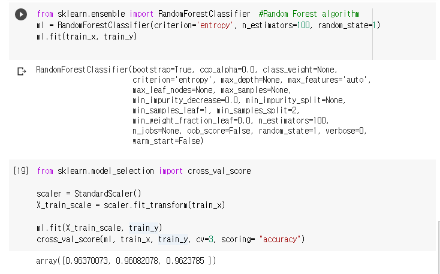

# 1. MNIST data에 대해 KNN 알고리즘 구현하기 (k = 1, 5, 10)


# 2. Random Forest 알고리즘 적용하기 (사이킷런 사용 가능)
`criterion` : impurity 지표로 사용할 함수(gini impurity/information gain)
`n_estimator` : random forest의 트리 수.
`random_state` : (none / 1)

등 여러가지 parameter가 있는데 

```python

```

 

