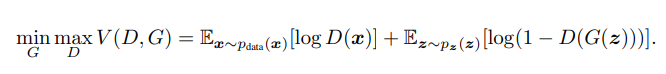

# GAN

`GAN`은 `Generative Adversarial Nets` 의 약자이다.

`Discriminator`와 `Generator`는 각각 다음과 같은 임무를 맡고있다.
**Discriminator**는 Generator로 받은 input과, sample data를 받아 최대한 옳게 식별할 수 있는 방향으로 훈련시킨다. 
**Generator**는 input으로 random noise를 받아 그 noise를 사용해 Discriminant가 sample data랑 식별하기 어려운 방향으로 data를 생성한다.

이러한 GAN model은 다음과 같이 구현할 수 있다.

이렇게 되면 `Discriminator` 와 `Generator`의 `minmax`로 가장 적합한 값을 다음과 같은 식으로 구할 수 있다.

실제 구현을 할때 초기 훈련단계에서 Generator는 image를 보지않고 z noise에서 data를 만들기 때문에 이상한 방향으로 훈련을 할 수 있다. 그렇기 때문에, log(1-D(G(z))을 minimize(data를 구별 못) 하게 하는 방향이 아니라 log(D(G(z))를 maximize(data를 구별)하는 방향으로 나아간다. 그러면 어차피 둘다 상호 훈련을 하기 때문에 결국에는  방향으로 나아간다.

논문에서는 다음의 그림을 제공한다. 녹색 그래프는 Generative Distribution, 검은 그래프가 Data Generating Distribution 파란 점선이 Discriminative Distribution 이다. 즉, 파란 선이 uniform하면 구별하기 어렵다는 뜻이고 초기에는 훈련이 잘 안되어 있기 때문에 distribution이 일정하지 않다. Generative Distribution은 아래의 Z domain을 따라 움직이는데, 이가 data Generating Distribution과 크게 상이 하지 않아야 Generative Dristibution과 일치한다.  
 

구현은 다음과 같은 방법을 통해 진행된다.

# DCGAN

`GAN`은 `Deep Convolution GAN` 의 약자이다.
convolutional and convolutional-transpose layers. 기존 `GAN`의 불안정한 문제점을 고치기 위해 publish 되었다. 

- Pooling layer를 strided Convoulutions 와 fractional-strided Convolution으로 바꾼다. 성능(speed)에 downgrade가 있더라도 정확도를 높히기 위해 사용한 듯 하다.

- Generator와 Discriminator에 Batch normalization을 적용시킨다. `GAN`에서는 Gradient Vanishing / Gradient Exploring 이라는 문제점이 일어나는데 이는 active function 등에 의해 input distribution이 변하기 때문이다. 그렇기 때문에 batch를 정규화를 시켜주면 이러한 경향이 사라진다.

다음은 Trial과 error로 이러한 것들이 좋더라 하는것을 알아냈는데 이는 다음과 같다.

- Fully Connected Hidden layer를 제거한다.
- Genertor에서 activation function으로 마지막 layer를 제외한 layer에서 ReLU를 사용한다
- Discriminator에서는 activation function으로 Leaky ReLU를 사용한다. 
