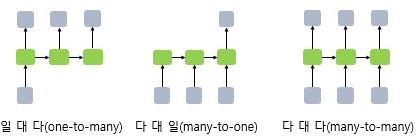
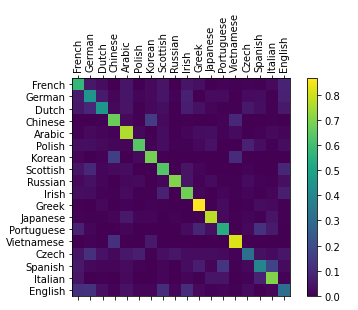
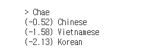

# RNN

고정되있는 크기를 process하는 CNN은 가변적인 데이터를 학습시키기에는 적합하지가 않다. CNN은 이미지 처리 등에 유리하다. RNN은 CNN과 달리 sequence의 길이에 영향을 받지 않는 네트워크 구조이다. 

RNN의 핵심은 **이전의 정보**를 기억하는데 있다.(이를 구현하기 위해서 저장공간이 필요하다. 이를 gated memory라고 부른다.)

구조는 `일대다`, `다대일`,  `다대다` 가 있는데

`일대다`의 대표적인 예로는 주어진 이미지에서 가변적인 이름을 만드는 것이다. 

네트워크가 사람의 특징, 오토바이의 특징, 비포장 도로 등의 특징을 찾아 그 확률이 높은 순대로 이름을 짜는 식인 것이다.

`다대다`는 다음과 같이 여러 단어가 들어왔을때 여러 단어를 다시 출력하는 Translation이 가장 유명한 예이다. 이는 입력 데이터 처리를 위한 encoder와 출력 데이터 처리를 위한 decoder로 구성된다.
(encoder-decoder)

`다대일`은 우리에게 주어진 python 코드가 아닌가 싶다. 내가 이해한 바로는 문자 하나하나가 연결되고 Spelling에 따라서 어떠한 나라의 성(surname)인지 알아내는 프로그램이다. 

## Extra
다음 그림은 프로그램을 돌렸을 때 나오는 통계인데 재미있는게 한국어랑 중국어랑 베트남어랑 헷갈린다고 한다. 

프로그램의 성능을 테스트 해보기 위해서 내 이름을 입력해보았다.

... 내 이름은 중국어에 가깝나 보다.