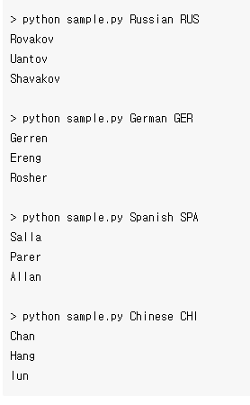
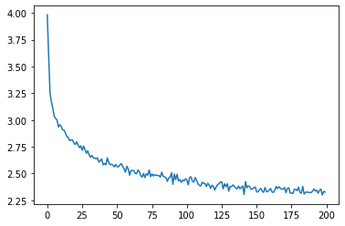
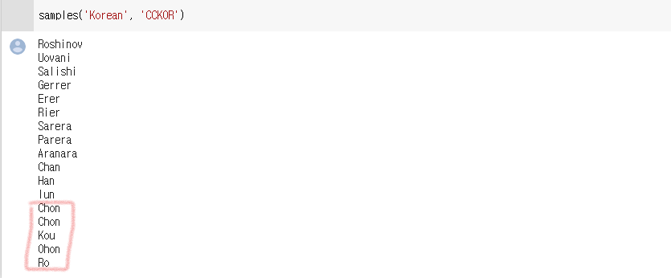
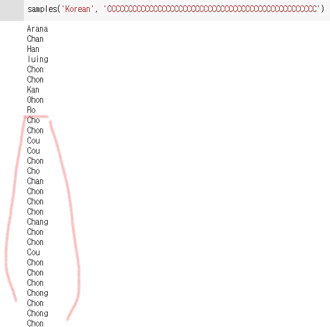

# NLP(Natural Language Processing) 

`NLP`, `자연어 처리`란, 우리가 실생활에서 사용하는 언어가 컴퓨터가 처리하게끔 하는 일이다. NLP는 `형태소 분석(morphological analysis)`, `구문 분석(syntactic analysis)`, `시멘틱 분석(semantic analysis)`과 문장이 실제로 무슨 의미를 내포하는지 결정하는 `실용 분석(pragmatic analysis)` 등으로 크게 나누어 구분할 수 있다.

`형태소 분석`은 입력문자열을 형태소열로 바꾸는 작업을 한다. 형태소란 의미의 최소단위로써, 단어의 문법적 혹은 관계적인 뜻을 나타낸다. 형태소 분석은 다음과 같은 과정을 거친다.

- 전처리
- 분석후보 생성
- 결합제약 검사
- 분석 후보 선택
- 후처리
 
`구문 분석`은 일반적으로 문장과 같은 언어를 분석하고 해당 언어의 **문법 규칙**을 사용하여 구성 요소를 식별하고 의미를 학습하는 방법이다. 

`시멘틱 분석`은 문장을 해석해서 형태소 차원에서 각각의 의미를 이해하는 것이다.   

`실용 분석` 문장의 뜻을 음정, 분위기, 목소리의 높낮이 등 실세계에서 어떻게 사용되었는지를 보고 분석을 하는 것이다. 

# pytorch 예재

이번 pytorch 예제에서는 `RNN`을 이용하여 input characters과 `나라`가 주어질 때 주어진 Characters를 사용하여 그 나라에 해당되는 이름을 print 하는 network이다.



아래 코드는 주어진 data를 사용 가능케 prepreocessing하는 코드이다. `data/names` 폴더 내에 있는 파일드를 읽고 카테고리를 지정해고, unicode에서 ASCII code로 전환해준다. 맨 아래 print하는 부분은 이것이 잘 작동하는 것을 확인할 수 있다.

```python
from __future__ import unicode_literals, print_function, division
from io import open
import glob
import os
import unicodedata
import string

all_letters = string.ascii_letters + " .,;'-"
n_letters = len(all_letters) + 1 # Plus EOS marker

def findFiles(path): return glob.glob(path)

# Turn a Unicode string to plain ASCII, thanks to https://stackoverflow.com/a/518232/2809427
def unicodeToAscii(s):
    return ''.join(
        c for c in unicodedata.normalize('NFD', s)
        if unicodedata.category(c) != 'Mn'
        and c in all_letters
    )

# Read a file and split into lines
def readLines(filename):
    lines = open(filename, encoding='utf-8').read().strip().split('\n')
    return [unicodeToAscii(line) for line in lines]

# Build the category_lines dictionary, a list of lines per category
category_lines = {}
all_categories = []
for filename in findFiles('data/names/*.txt'):
    category = os.path.splitext(os.path.basename(filename))[0]
    all_categories.append(category)
    lines = readLines(filename)
    category_lines[category] = lines

n_categories = len(all_categories)

if n_categories == 0:
    raise RuntimeError('Data not found. Make sure that you downloaded data '
        'from https://download.pytorch.org/tutorial/data.zip and extract it to '
        'the current directory.')

print('# categories:', n_categories, all_categories)
print(unicodeToAscii("O'Néàl"))
```

이제 RNN을 다음과 같이 구현을 해야한다.

 

Input과 category를 받아서 hidden 과 output으로 돌려주며 그 와중에 i2o, i2h연산을 해준다. 그렇게 여러번 하여 종합된 output을 o2o연산을 시킨다음 dropout을 통해 overfitting을 방지한다. 이를 back propagating하며 학습을 시킨다.


```python
import torch
import torch.nn as nn

class RNN(nn.Module):
    def __init__(self, input_size, hidden_size, output_size):
        super(RNN, self).__init__()
        self.hidden_size = hidden_size

        self.i2h = nn.Linear(n_categories + input_size + hidden_size, hidden_size)
        self.i2o = nn.Linear(n_categories + input_size + hidden_size, output_size)
        self.o2o = nn.Linear(hidden_size + output_size, output_size)
        self.dropout = nn.Dropout(0.1)
        self.softmax = nn.LogSoftmax(dim=1)

    def forward(self, category, input, hidden):
        input_combined = torch.cat((category, input, hidden), 1)
        hidden = self.i2h(input_combined)
        output = self.i2o(input_combined)
        output_combined = torch.cat((hidden, output), 1)
        output = self.o2o(output_combined)
        output = self.dropout(output)
        output = self.softmax(output)
        return output, hidden

    def initHidden(self):
        return torch.zeros(1, self.hidden_size)
```

이제 네트워크와 데이터 preprocessing이 끝났으니까 training을 위해 준비해야한다. 

1. **training을 위하여 category를 무작위로 선택하여 letter 다음에 올 letter을 선택하는 함수들을 만든다.**
1. **category들과 letters들을 위하여 one-hot vecotr을 만들고 EOS를 처리하기 위한 함수를 만든다**
1. **편의를 위해 (category, line)을 받아 (category, line), target)를 return하는 함수를 만든다.**

이제 trainining을 위한 준비는 끝났다. 이제 이 함수들을 통합하고 라이브러리의 rnn함수만 사용해주면 된다.

```python
criterion = nn.NLLLoss()

learning_rate = 0.0005

def train(category_tensor, input_line_tensor, target_line_tensor):
    target_line_tensor.unsqueeze_(-1)
    hidden = rnn.initHidden()

    rnn.zero_grad()

    loss = 0

    for i in range(input_line_tensor.size(0)):
        output, hidden = rnn(category_tensor, input_line_tensor[i], hidden)
        l = criterion(output, target_line_tensor[i])
        loss += l

    loss.backward()

    for p in rnn.parameters():
        p.data.add_(p.grad.data, alpha=-learning_rate)

    return output, loss.item() / input_line_tensor.size(0)
```

다음은 training의 code와 결과이다.결과물은 (current_time, cur_iteration, progress_percentage, loss) 로 표현이 된다.



훈련이 끝났으니 이제 실제 데이터를 돌려보자


다음 같이 잘 돌아가는 것이 확인되었다.



근데 하다보니 만약 같은 Character가 들어가면 같은 값을 줄까 궁금했다. 혹은 dataset에 없는 긴 String이 들어가면 어떻게 될까 궁금해서 다음과 같이 `'CCCCCCCCCCCCCCCCCCCCCCCCCC`라는 데이터를 넣어보았다. 



나의 예상과는 다르게 계속 다른 값이 나오는것 뿐만 아니라 규칙도 없어보이게 계속 다른 값이 나왔다. 왜 그런지는 잘 모르겠지만 아마 dataset에 없는 예외니까 parameter도 이상하게 setting이 되어서 그런게 아닌가 싶다.