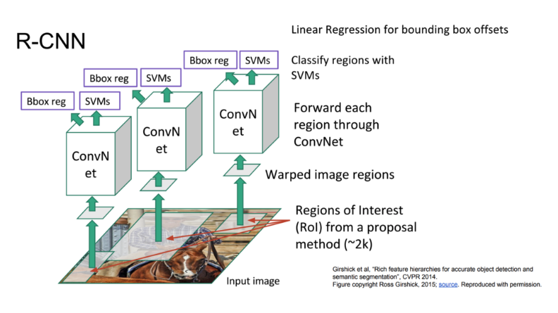
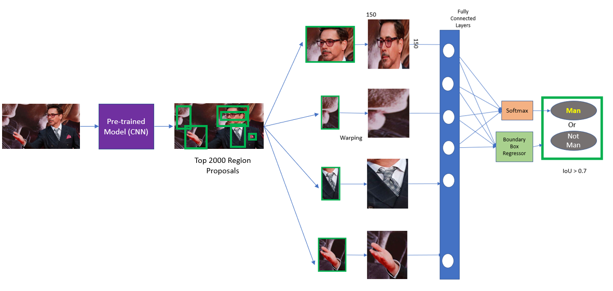
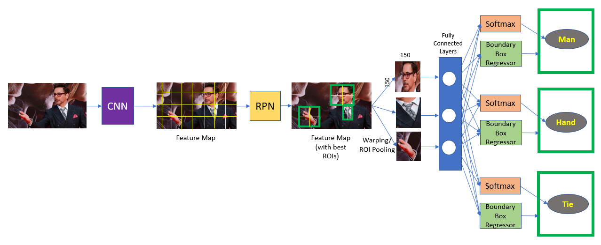
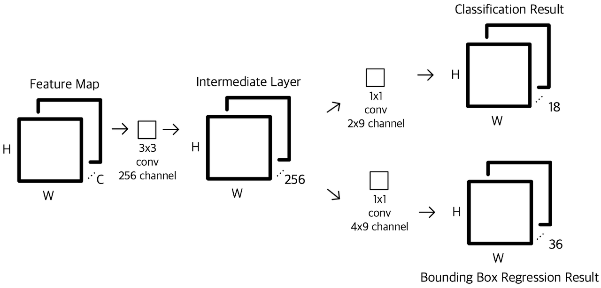
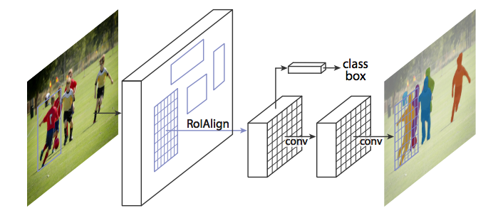
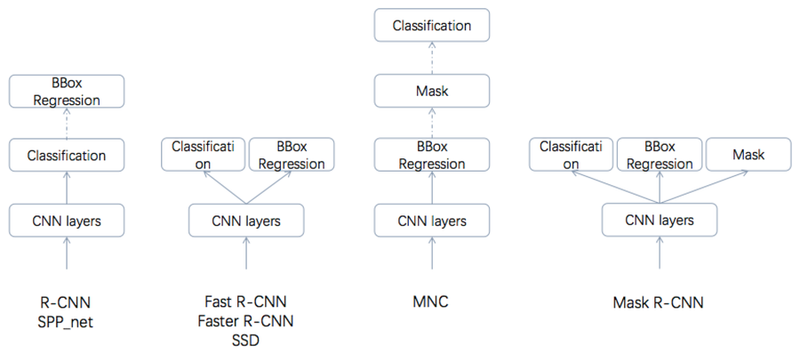

# Mask R-CNN

`Mask R-CNN`은 `Faster R-CNN`이 Fixel 단위의 Segmentaion이 가능하도록 한 모델이다. 다음은 `Mask R-CNN`을 적용한 사진이다. 보다싶히 같은 유형(사람)의 instances 들이 다른 color로 나타난 것을 볼 수 있다.

이를 `Sementic Image Segmentation` 이라고 한다. 이는 다음과 같이 `Selective Search`라는 algorithm을 써 실제 객체에 해당되는 물체를 찾게 된다. 

그렇다면 `R-CNN`은 무엇일까? `R-CNN`은 `Region Convolutionary Neural Network`의 약자로, 다음과 같은 방법을 통해 학습을 한다. 대강 설명하자면 3개의 모듈로 나누어져있는데, 이는 `CNN`(feauture Vector 뽑는 부분),`Bounding Box regression`(박스의 위치), ,`SVM Classifier`(검출된 feature들로 분류하는 것)이다.

정말로 간단히 말하자면 `Mask R-CNN`은 이러한 기술의 효율성을 발전한 형태다. 중복된 계산을 줄이고(`RoI pooling`),본래 3개의 모듈이었던 부분을 하나의 `network`로 합치고, 픽셀수준의 segmentation을 가능케하였다. 이는 각각 `fast R-CNN`, `faster R-CNN`, `Mask R-CNN` 이라고 불린다.
그럼 각각의 기술에 대해 설명해보겠다.

1. **fast R-CNN**
기존의 `search algorithm`으로 최고의 roi를 찾는것이 아니라 image를 바로 `CNN`에 넣어 나오는 feature map에서 제공되는 ROI를 `Seletive Searching`하고. 

`ROI pooling`을 통해 feature size를 줄인다. 

1. **faster R-CNN**

이제는 아예 `Selective Search Algorithm`을 쓰지 않고 RPN(Region Proposal Network)라는 것을 쓴다. RPN은 다음과 같은 구조를 가진다.

1. **mask R-CNN**
feature map을 `Masking` 하는 부분 또한 병렬적으로 수행하기 시작한다. 또한, 이전의 `RoI pooling`을 할 때 소수값으로 `roi의 coordinates`가 나올 시 정확하지 않은 값을 반환하는 문제점을 보완하기 위해 `binear interpolation`이라는 기법을 사용한 `RoI Align`을 사용한다.

다음은 여러 model들을 비교한 사진이다.

